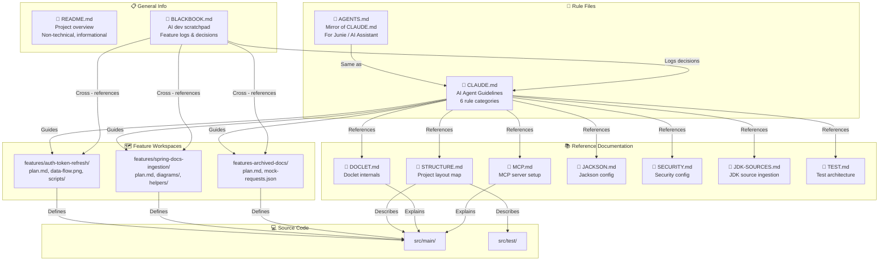

# Black Book

> A log of thoughts, problems, and details encountered during AI-assisted development of this project.

## Purpose

This file captures the informal side of building JAIDoc with AI — things that don't belong in Javadoc, commit messages,
or documentation:

- **Thoughts** — Design decisions, trade-offs, and "why I chose this" moments that deserve a record
- **Problems** — Bugs, blockers, and gotchas that took time to resolve, so we don't forget how we fixed them
- **Details** — Small quirks, workarounds, and observations about the AI tools and workflow

It's not a formal artifact. It's a scratchpad for the things worth remembering, but that doesn't fit anywhere else.

---

## 2026-06-14

### 📋 Created BLACKBOOK.md

Initial setup of this file. Added the purpose section and a reference link in `README.md` so it's discoverable.

---

### 🏗️ Architecture: AI-Assisted Development System

> ⚠️ **Provisional design** — The overall architecture for rules + references is established. The `features/` workspace
> concept is a **proposal**, not yet implemented. We need to validate if it's actually
> functional before adopting it as a standard.

This section documents how the project's documentation and rules system is structured to support AI-assisted
development.
It maps the relationships between the rule files, reference docs, and feature workspaces — and explains how data flows
between them during feature development.

#### 🔗 System Overview



#### 📂 Folder Architecture

**Repository (JAIDoc/)**

```
JAIDoc/
├── 📄 CLAUDE.md                          ← 📜 Core rule file (AI agent guidelines)
├── 📄 AGENTS.md                          ← 📜 Mirror of CLAUDE.md (for Junie / AI Assistant CLI)
├── 📄 README.md                          ← 📋 General project overview (non-technical)
├── 📓 BLACKBOOK.md                       ← 📝 AI-assisted dev scratchpad & feature logs
├── 📚 documentation/                     ← 📚 Deep-dive reference docs (AI context)
│   ├── 📖 STRUCTURE.md                   ← Project layout map
│   ├── 📖 DOCLET.md                      ← Doclet architecture & CLI options
│   ├── 📖 MCP.md                         ← MCP server setup
│   ├── 📖 JACKSON.md                     ← Jackson customizer pattern
│   ├── 📖 SECURITY.md                    ← Security config details
│   ├── 📖 JDK-SOURCES.md                 ← JDK source ingestion pipeline
│   └── 📖 TEST.md                        ← Test class hierarchy & tags
├── 💻 src/
│   ├── 📂 main/java/com/purrbyte/ai/     ← Application source
│   │   ├── 📄 JAIDoc.java                ← Spring Boot entry point
│   │   ├── 📂 configuration/             ← JSON serialization config
│   │   ├── 📂 doclet/                    ← JSON Javadoc serialization
│   │   └── 📂 util/                      ← Shared utilities
│   ├── 📂 main/resources/                ← Main resources
│   │   ├── 🔧 application.yaml           ← Main config file
│   │   └── 📁 configurations/            ← Profile YAMLs
│   └── 📂 test/
│       └── 📂 java/com/purrbyte/ai/test/ ← Test source hierarchy (base for test classes)
│           ├── 📄 BaseTest               ← Common test base class
│           └── 📄 ...                    ← Other shared test utilities
├── ⚙️ pom.xml                            ← Maven build file
```

> 💡 **Test resource config:** `src/test/resources/` has hardcoded values for the test environment — local URLs, mocked
> ports, dummy credentials. No issues when running tests. In the future, this is planned to be adjusted for greater
> flexibility.

**Workspace (features/ — proposed addition to the repo)**

> ⚠️ **Proposal only** — This structure is a design idea, not yet implemented. Needs validation to determine if it's
> functional.

```
features/
├── 📂 auth-token-refresh/               ← Feature: JWT token refresh flow
│   ├── 📄 plan.md                       ← Implementation plan
│   ├── 📄 data-flow.png                 ← Architecture diagram
│   ├── 📄 mock-requests.json            ← Mock API responses
│   ├── 📂 scripts/                      ← Helper scripts for testing
│   └── 📄 notes.md                      ← Observations & decisions
├── 📂 spring-docs-ingestion/            ← Feature: Spring Boot docs ingestion
│   ├── 📄 plan.md
│   ├── 📄 diagrams/
│   ├── 📂 helpers/
│   └── 📄 notes.md
└── 📂 archived-docs/                    ← Feature: Versioned/archived doc support
    ├── 📄 plan.md
    ├── 📄 mock-requests.json
    └── 📄 notes.md
```

#### 📊 Rule File Summary

| File           | Category      | Purpose                                               | AI Impact                                     |
|----------------|---------------|-------------------------------------------------------|-----------------------------------------------|
| `CLAUDE.md`    | 📜 Rules      | Guidelines for AI agents working in the repo          | **HIGH** — Directly constrains AI behavior    |
| `AGENTS.md`    | 📜 Mirror     | Same rules, for other CLI tools (Junie, AI Assistant) | **HIGH** — Same impact as CLAUDE.md           |
| `README.md`    | 📋 Info       | Project overview, setup, philosophy                   | **LOW** — Informative only, no constraints    |
| `BLACKBOOK.md` | 📝 Scratchpad | AI dev log: thoughts, decisions, gotchas              | **MEDIUM** — Context for historical decisions |

#### 📊 Reference Documentation Summary

| Document         | Topic                                           | AI Impact                             |
|------------------|-------------------------------------------------|---------------------------------------|
| `STRUCTURE.md`   | Project layout & config hierarchy               | **MEDIUM** — Navigational context     |
| `DOCLET.md`      | Doclet architecture, CLI options, output format | **HIGH** — Deep implementation detail |
| `MCP.md`         | MCP server setup & JetBrains adapter            | **HIGH** — Core protocol detail       |
| `JACKSON.md`     | Customizer pattern, YAML mapper convention      | **HIGH** — Config system detail       |
| `SECURITY.md`    | Actuator restrictions, logging paths            | **MEDIUM** — Security policy          |
| `JDK-SOURCES.md` | JDK source downloader, async execution          | **HIGH** — Ingestion pipeline detail  |
| `TEST.md`        | Test class hierarchy, tags, JsonMapper setup    | **MEDIUM** — Test conventions         |

#### 🔀 Data Flow: Feature Development Lifecycle

> ⚠️ **Proposal only** — The data flow through `features/` is a design concept, not yet implemented.

```
                    ┌─────────────────────────────────────────────────────────────┐
                    │          FEATURE DEVELOPMENT LIFECYCLE                       │
                    └─────────────────────────────────────────────────────────────┘

    1. DISCOVER          2. PLAN              3. IMPLEMENT         4. VERIFY          5. LOG

    ┌──────────┐      ┌──────────┐        ┌──────────┐        ┌──────────┐        ┌──────────┐
    │ CLAUDE/  │─────▶│ features/  │───────▶│ src/     │───────▶│ Tests    │───────▶│ BLACKBOOK│
    │ AGENTS   │      │ *.md     │        │ main/    │        │ / test/  │        │ *.md     │
    └──────────┘      └──────────┘        └──────────┘        └──────────┘        └──────────┘
       │                   │                  │                  │                  │
       │ Rules             │ Plan doc         │ Code changes     │ Verification     │ Feature log
       │ constrain AI      │ Documents        │ Implements       │ Confirms         │ Records decisions
       │ behavior          │ Intent & scope   │ the design       │ it works         │ & gotchas
       │                     │                  │                  │                  │
    ┌──────────┐      ┌──────────┐        ┌──────────┐        ┌──────────┐        ┌──────────┐
    │ docs/    │◀──────│          │◀───────│          │◀───────▶│          │◀───────│          │
    │ *.md     │       │          │         │          │        │          │        │          │
    └──────────┘       └──────────┘        └──────────┘        └──────────┘        └──────────┘
       │                   │                  │                  │                  │
       │ Reference         │ Cross-ref        │ Cross-ref        │ Cross-ref        │ Cross-ref
       │ context for       │ to docs          │ to docs          │ to docs          │ to CLAUDE/
       │ AI deep-dive      │ when needed      │ when needed      │ when needed      │ AGENTS
```

#### 🔄 How Data Moves During a Feature

> ⚠️ **Proposal only** — Steps involving `features/` are design concepts, not yet implemented.

| Step                  | Action                          | Files Read                                              | Files Written                | AI Context Used                        |
|-----------------------|---------------------------------|---------------------------------------------------------|------------------------------|----------------------------------------|
| **1. Discovery**      | Understand scope & constraints  | `CLAUDE.md` / `AGENTS.md`, `docs/*.md`                  | —                            | Rule constraints + domain context      |
| **2. Planning**       | Write implementation plan       | `CLAUDE.md` / `AGENTS.md`, `docs/*.md`                  | `features/feature-*/plan.md` | Rule constraints + deep-dive docs      |
| **3. Implementation** | Code the feature                | `CLAUDE.md` / `AGENTS.md`, `docs/*.md`, `src/main/*`    | `src/main/*`                 | Rules + reference docs + existing code |
| **4. Verification**   | Run tests & validate            | `CLAUDE.md` / `AGENTS.md`, `docs/TEST.md`, `src/test/*` | —                            | Test conventions + rule constraints    |
| **5. Logging**        | Record decisions & observations | `CLAUDE.md` / `AGENTS.md`, `BLACKBOOK.md`               | `BLACKBOOK.md`               | Rules for documentation format         |

#### 🏠 Feature Folder Structure

> ⚠️ **Proposal only** — This structure is a design idea, not yet implemented.

Each feature will get its own workspace folder in the `features/` directory. The naming convention is:

```
features/<feature-name>/
```

**Naming rules:**

- Prefix with `feature-` for new features, `fix-` for bug fixes
- Use kebab-case for multi-word names
- Keep names descriptive but concise
- Reflects the actual feature or fix being implemented

**Example feature workspace:**

```
features/
├── auth-token-refresh/                    ← JWT token refresh flow
│   ├── 📄 plan.md
│   ├── 📄 data-flow.png
│   ├── 📂 scripts/
│   └── 📄 notes.md
├── spring-docs-ingestion/                 ← Spring Boot docs ingestion
│   ├── 📄 plan.md
│   ├── 📂 diagrams/
│   └── 📄 notes.md
└── archived-docs/                         ← Versioned/archived doc support
    ├── 📄 plan.md
    ├── 📄 mock-requests.json
    └── 📄 notes.md
```

#### 📝 Feature Workspace Conventions

> ⚠️ **Proposal only** — Convention details are design ideas, not yet implemented.

| Field               | Purpose                            | Example                                          |
|---------------------|------------------------------------|--------------------------------------------------|
| `# Title`           | Feature name                       | `# Auth Token Refresh`                           |
| `## Context`        | Why this feature exists            | `JWT tokens expire every 15min`                  |
| `## Scope`          | What's in/out of scope             | `In: refresh flow, Out: token rotation`          |
| `## Implementation` | Step-by-step approach              | `1. Add RefreshTokenService ...`                 |
| `## Data Flow`      | How data moves through the feature | `Request → TokenService → HTTP call`             |
| `## Tests`          | Expected test coverage             | `Unit: TokenService, Integration: /auth/refresh` |
| `## Notes`          | Edge cases & gotchas               | `Rate limiting on refresh endpoint`              |

#### 🔗 Cross-Reference Map

> ⚠️ **Proposal only** — References to `features/*` are design ideas, not yet implemented.

```
CLAUDE.md ──────┬────── AGENTS.md        ← Same content, different CLI tools
                │
                ├────── docs/STRUCTURE.md ← "Keep STRUCTURE.md in sync"
                ├────── docs/DOCLET.md    ← "Keep deep-dive docs current"
                ├────── docs/MCP.md       ← "Keep deep-dive docs current"
                ├────── docs/JACKSON.md   ← "Keep deep-dive docs current"
                ├────── docs/SECURITY.md  ← "Keep deep-dive docs current"
                ├────── docs/JDK-SOURCES.md ← "Keep deep-dive docs current"
                └────── docs/TEST.md      ← "Keep deep-dive docs current"

BLACKBOOK.md ───┬────── CLAUDE.md / AGENTS.md  ← "Document decisions per rules"
                ├────── features/*            ← "Cross-reference feature workspaces"
                └────── src/*                 ← "Log implementation decisions"

features/* ─────┬────── CLAUDE.md / AGENTS.md  ← "Follow rules for implementation"
                ├────── docs/*.md             ← "Reference deep-dive context"
                └────── src/*                 ← "Describe implementation"
```

#### 🎯 Key Design Principles

| Principle                          | Description                                                                                                          |
|------------------------------------|----------------------------------------------------------------------------------------------------------------------|
| **📐 Separation of Concerns**      | Rules (CLAUDE.md), references (docs/), and scratchpad (BLACKBOOK.md) serve different purposes                        |
| **🔄 Single Source of Truth**      | CLAUDE.md is the canonical rule file; AGENTS.md mirrors it for other tools                                           |
| **🔍 AI-First Context**            | Reference docs exist so AI doesn't need to read source code to understand implementation details                     |
| **📝 Traceable Decisions**         | BLACKBOOK.md captures the "why" behind decisions, not just the "what"                                                |
| **🗺️ Feature-Driven Development** | Every feature has a workspace folder that documents intent before implementation — **proposed, not yet implemented** |
| **📚 Living Documentation**        | Documentation must be updated in the same session as code changes — stale docs are worse than no docs                |
