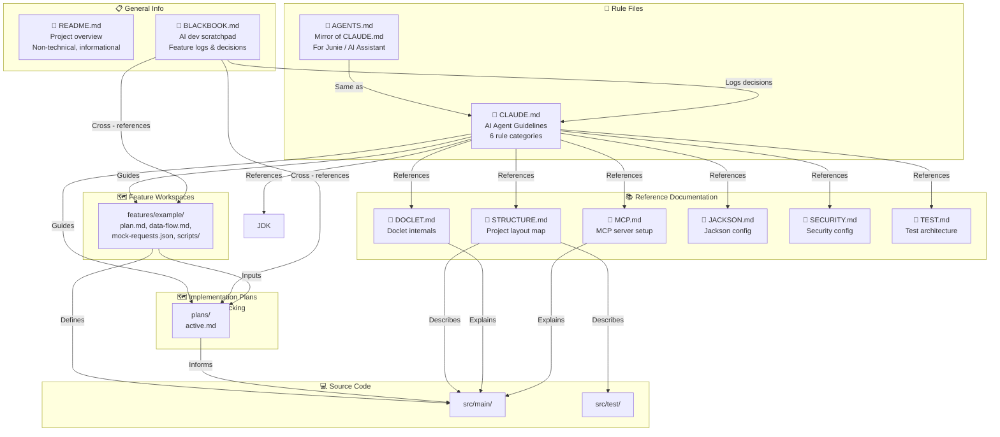

# Black Book

> A log of thoughts, problems, and details encountered during AI-assisted development of this project.

## Purpose

This file captures the informal side of building JAIDoc with AI — things that don't belong in Javadoc, commit messages,
or documentation:

- **Thoughts** — Design decisions, trade-offs, and "why I chose this" moments that deserve a record
- **Problems** — Bugs, blockers, and gotchas that took time to resolve, so we don't forget how we fixed them
- **Details** — Small quirks, workarounds, and observations about the AI tools and workflow

It's not a formal artifact. It's a scratchpad for the things worth remembering, but that doesn't fit anywhere else.

---

## 2026-06-14

### 📋 Created BLACKBOOK.md

Initial setup of this file. Added the purpose section and a reference link in `README.md` so it's discoverable.

---

### 🏗️ Architecture: AI-Assisted Development System

The overall architecture for rules + references is established and validated. It includes both feature workspaces
(`features/`) for tracking actual feature development, and implementation plans (`plans/`) for planning implementation
using feature elements as inputs — each with lifecycle tracking (active/completed/deprecated).

This section documents how the project's documentation and rules system is structured to support AI-assisted
development.
It maps the relationships between the rule files, reference docs, and feature workspaces — and explains how data flows
between them during feature development.

#### 🔗 System Overview



#### 📂 Folder Architecture

**Repository (JAIDoc/)**

```
JAIDoc/
├── 📄 CLAUDE.md                          ← 📜 Core rule file (AI agent guidelines)
├── 📄 AGENTS.md                          ← 📜 Mirror of CLAUDE.md (for Junie / AI Assistant CLI)
├── 📄 README.md                          ← 📋 General project overview (non-technical)
├── 📓 BLACKBOOK.md                       ← 📝 AI-assisted dev scratchpad & feature logs
├── 📚 documentation/                     ← 📚 Deep-dive reference docs (AI context)
│   ├── 📖 STRUCTURE.md                   ← Project layout map
│   ├── 📖 DOCLET.md                      ← Doclet architecture & CLI options
│   ├── 📖 MCP.md                         ← MCP server setup
│   ├── 📖 JACKSON.md                     ← Jackson customizer pattern
│   ├── 📖 SECURITY.md                    ← Security config details
│   └── 📖 TEST.md                        ← Test class hierarchy & tags
├── 🗺️ features/                         ← 🗺️ Feature workspaces (actual feature tracking)
│   ├── 📄 FEATURE.md                     ← Feature index
│   └── 📂 example/                       ← Template feature workspace
│       ├── 📄 plan.md
│       ├── 📄 data-flow.md
│       ├── 📄 mock-requests.json
│       ├── 📂 scripts/
│       └── 📄 notes.md
├── 🗺️ plans/                            ← 🗺️ Implementation plans with lifecycle tracking
│   ├── 📄 ACTIVE.md                      ← Active/completed/deprecated plan index
│   └── 📄 <name>.md                      ← Individual plan (YAML frontmatter + content)
├── 💻 src/
│   ├── 📂 main/java/com/purrbyte/ai/     ← Application source
│   │   ├── 📄 JAIDoc.java                ← Spring Boot entry point
│   │   ├── 📂 configuration/             ← JSON serialization config
│   │   ├── 📂 doclet/                    ← JSON Javadoc serialization
│   │   └── 📂 util/                      ← Shared utilities
│   ├── 📂 main/resources/                ← Main resources
│   │   ├── 🔧 application.yaml           ← Main config file
│   │   └── 📁 configurations/            ← Profile YAMLs
│   └── 📂 test/
│       └── 📂 java/com/purrbyte/ai/test/ ← Test source hierarchy (base for test classes)
│           ├── 📄 BaseTest               ← Common test base class
│           └── 📄 ...                    ← Other shared test utilities
├── ⚙️ pom.xml                            ← Maven build file
```

> 💡 **Test resource config:** `src/test/resources/` has hardcoded values for the test environment — local URLs, mocked
> ports, dummy credentials. No issues when running tests. In the future, this is planned to be adjusted for greater
> flexibility.

**Workspace (features/ — feature tracking)**

```
features/
├── FEATURE.md                           ← Feature index
└── example/                             ← Template feature workspace
    ├── plan.md                          ← Implementation plan with YAML frontmatter
    ├── data-flow.md                     ← Data flow description with sequence diagram
    ├── mock-requests.json               ← Mock API responses for testing
    ├── scripts/                         ← Helper scripts (validate.sh)
    └── notes.md                         ← Observations & decisions
```

See `features/` for the directory layout and the example template.

#### 📊 Rule File Summary

| File           | Category      | Purpose                                                | AI Impact                                     |
|----------------|---------------|--------------------------------------------------------|-----------------------------------------------|
| `CLAUDE.md`    | 📜 Rules      | Guidelines for AI agents working in the repo           | **HIGH** — Directly constrains AI behavior    |
| `AGENTS.md`    | 📜 Mirror     | Same rules, for other CLI tools (Junie, AI Assistant)  | **HIGH** — Same impact as CLAUDE.md           |
| `README.md`    | 📋 Info       | Project overview, setup, philosophy                    | **LOW** — Informative only, no constraints    |
| `BLACKBOOK.md` | 📝 Scratchpad | AI dev log: thoughts, decisions, gotchas               | **MEDIUM** — Context for historical decisions |
| `plans/`       | 🗺️ Plans     | Versioned implementation plans with lifecycle tracking | **HIGH** — AI reads active plans only         |

#### 📊 Reference Documentation Summary

| Document         | Topic                                           | AI Impact                             |
|------------------|-------------------------------------------------|---------------------------------------|
| `STRUCTURE.md`   | Project layout & config hierarchy               | **MEDIUM** — Navigational context     |
| `DOCLET.md`      | Doclet architecture, CLI options, output format | **HIGH** — Deep implementation detail |
| `MCP.md`         | MCP server setup & JetBrains adapter            | **HIGH** — Core protocol detail       |
| `JACKSON.md`     | Customizer pattern, YAML mapper convention      | **HIGH** — Config system detail       |
| `SECURITY.md`    | Actuator restrictions, logging paths            | **MEDIUM** — Security policy          |
| `TEST.md`        | Test class hierarchy, tags, JsonMapper setup    | **MEDIUM** — Test conventions         |

#### 🔀 Data Flow: Feature Development Lifecycle

```
                    ┌─────────────────────────────────────────────────────────────┐
                    │          FEATURE DEVELOPMENT LIFECYCLE                       │
                    └─────────────────────────────────────────────────────────────┘

    1. DISCOVER          2. PLAN              3. IMPLEMENT         4. VERIFY          5. LOG

    ┌──────────┐      ┌──────────┐        ┌──────────┐        ┌──────────┐        ┌──────────┐
    │ CLAUDE/  │─────▶│ features/    │───────▶│ plans/     │───────▶│ src/     │───────▶│ Tests    │
    │ AGENTS   │      │ *.md     │        │ *.md     │        │ main/    │        │ / test/  │
    └──────────┘      └──────────┘        └──────────┘        └──────────┘        └──────────┘
       │                   │                  │                  │                  │
       │ Rules             │ Feature spec     │ Plan doc         │ Code changes     │ Verification
       │ constrain AI      │ Documents        │ Uses feature     │ Implements       │ Confirms
       │ behavior          │ Intent & scope   │ elements as      │ the design       │ it works
       │                     │                  │ inputs           │                  │
    ┌──────────┐      ┌──────────┐        ┌──────────┐        ┌──────────┐        ┌──────────┐
    │ docs/    │◀──────│          │◀───────│          │◀───────▶│          │◀───────│          │
    │ *.md     │       │          │         │          │        │          │        │          │
    └──────────┘       └──────────┘        └──────────┘        └──────────┘        └──────────┘
       │                   │                  │                  │                  │
       │ Reference         │ Cross-ref        │ Cross-ref        │ Cross-ref        │ Cross-ref
       │ context for       │ to docs          │ to docs          │ to docs          │ to CLAUDE/
       │ AI deep-dive      │ when needed      │ when needed      │ when needed      │ AGENTS
```

#### 🔄 How Data Moves During a Feature

| Step                  | Action                          | Files Read                                              | Files Written       | AI Context Used                        |
|-----------------------|---------------------------------|---------------------------------------------------------|---------------------|----------------------------------------|
| **1. Discovery**      | Understand scope & constraints  | `CLAUDE.md` / `AGENTS.md`, `docs/*.md`                  | —                   | Rule constraints + domain context      |
| **2. Feature Design** | Define feature workspace        | `CLAUDE.md` / `AGENTS.md`, `docs/*.md`                  | `features/<name>/*` | Rule constraints + deep-dive docs      |
| **3. Planning**       | Write implementation plan       | `CLAUDE.md` / `AGENTS.md`, `docs/*.md`, `features/*`    | `plans/<name>.md`   | Rule constraints + feature inputs      |
| **4. Implementation** | Code the feature                | `CLAUDE.md` / `AGENTS.md`, `docs/*.md`, `src/main/*`    | `src/main/*`        | Rules + reference docs + existing code |
| **5. Verification**   | Run tests & validate            | `CLAUDE.md` / `AGENTS.md`, `docs/TEST.md`, `src/test/*` | —                   | Test conventions + rule constraints    |
| **6. Logging**        | Record decisions & observations | `CLAUDE.md` / `AGENTS.md`, `BLACKBOOK.md`               | `BLACKBOOK.md`      | Rules for documentation format         |

#### 🗺️ Plan File Structure

Each plan lives in the `plans/` directory with a YAML frontmatter for lifecycle tracking. Plans use feature workspaces
(`features/*`) as inputs — they reference feature elements (data-flow diagrams, mock requests, scripts) to inform
the implementation approach.

```
plans/
├── ACTIVE.md                                  ← Active/completed/deprecated index
├── documentation-service-approach-a-fat-jar   ← Completed plan
│   └── .md
├── new-feature-name                           ← Active plan
│   └── .md
└── deprecated-plan                            ← Deprecated plan
    └── .md
```

**YAML frontmatter:**

```yaml
---
name: <descriptive-name>
status: active | completed | deprecated
date: YYYY-MM-DD
---
```

**Plan content structure:**

| Section             | Purpose                            | Example                                        |
|---------------------|------------------------------------|------------------------------------------------|
| `# Title`           | Feature name                       | `# JDK Docs Ingestion`                         |
| `## Context`        | Why this feature exists            | `JDK docs are locked in HTML, not queryable`   |
| `## Feature Inputs` | Feature workspace references       | `features/example/data-flow.md`                |
| `## Scope`          | What's in/out of scope             | `In: JDK source → JSON, Out: Spring Boot`      |
| `## Implementation` | Step-by-step approach              | `1. Download JDK source ...`                   |
| `## Data Flow`      | How data moves through the feature | `Request → Doclet → JSON output`               |
| `## Tests`          | Expected test coverage             | `Unit: JsonDoclet, Integration: DocletService` |
| `## Notes`          | Edge cases & gotchas               | `Zip-slip protection during extraction`        |

**Key:** The `## Feature Inputs` section explicitly references feature workspace elements that inform the plan.
A plan should never duplicate feature workspace content — it should reference it.

#### 📝 Plan Lifecycle

Plans move through three states tracked in their YAML frontmatter:

1. **Active** — Plan is being implemented. The AI should read and follow it.
2. **Completed** — Implementation finished. The AI should skip it.
3. **Deprecated** — Plan is abandoned or superseded. The AI should never follow it.

The `plans/ACTIVE.md` index is the authoritative source for which plans are currently active.

#### 🗺️ Feature Workspace Structure

Feature workspaces live in the `features/` directory and track actual feature development — not just implementation
plans, but the full context including diagrams, mock requests, and helper scripts. Each feature workspace is a
complete artifact that stands on its own.

```
features/
├── FEATURE.md                           ← Feature index
└── example/                             ← Template feature workspace
    ├── plan.md                          ← Implementation plan with YAML frontmatter
    ├── data-flow.md                     ← Data flow description with sequence diagram
    ├── mock-requests.json               ← Mock API responses for testing
    ├── scripts/                         ← Helper scripts (validate.sh)
    └── notes.md                         ← Observations & decisions
```

**Naming rules:**

- Prefix with `feature-` for new features, `fix-` for bug fixes
- Use kebab-case for multi-word names
- Keep names descriptive but concise
- Reflects the actual feature or fix being implemented

#### 📝 Feature Workspace Conventions

| Field               | Purpose                            | Example                                        |
|---------------------|------------------------------------|------------------------------------------------|
| `# Title`           | Feature name                       | `# JDK Docs Ingestion`                         |
| `## Context`        | Why this feature exists            | `JDK docs are locked in HTML, not queryable`   |
| `## Scope`          | What's in/out of scope             | `In: JDK source → JSON, Out: Spring Boot`      |
| `## Implementation` | Step-by-step approach              | `1. Download JDK source ...`                   |
| `## Data Flow`      | How data moves through the feature | `Request → Doclet → JSON output`               |
| `## Tests`          | Expected test coverage             | `Unit: JsonDoclet, Integration: DocletService` |
| `## Notes`          | Edge cases & gotchas               | `Zip-slip protection during extraction`        |

#### 🔗 Cross-Reference Map

```
CLAUDE.md ──────┬────── AGENTS.md        ← Same content, different CLI tools
                │
                ├────── docs/STRUCTURE.md ← "Keep STRUCTURE.md in sync"
                ├────── docs/DOCLET.md    ← "Keep deep-dive docs current"
                ├────── docs/MCP.md       ← "Keep deep-dive docs current"
                ├────── docs/JACKSON.md   ← "Keep deep-dive docs current"
                ├────── docs/SECURITY.md   ← "Keep deep-dive docs current"
                └────── docs/TEST.md       ← "Keep deep-dive docs current"

BLACKBOOK.md ───┬────── CLAUDE.md / AGENTS.md  ← "Document decisions per rules"
                ├────── features/*            ← "Cross-reference feature workspaces"
                ├────── plans/*              ← "Cross-reference plan lifecycle"
                └────── src/*                 ← "Log implementation decisions"

features/* ─────┬────── CLAUDE.md / AGENTS.md  ← "Follow rules for implementation"
                ├────── FEATURE.md           ← "Feature index — read first"
                ├────── docs/*.md             ← "Reference deep-dive context"
                ├────── plans/*              ← "Cross-reference plan lifecycle"
                └────── src/*                 ← "Describe implementation"

plans/* ────────┬────── CLAUDE.md / AGENTS.md  ← "Follow rules for implementation"
                ├────── features/*            ← "Use feature elements as inputs"
                ├────── docs/*.md             ← "Reference deep-dive context"
                └────── src/*                 ← "Describe implementation"
```

#### 🎯 Key Design Principles

| Principle                          | Description                                                                                           |
|------------------------------------|-------------------------------------------------------------------------------------------------------|
| **📐 Separation of Concerns**      | Rules (CLAUDE.md), references (docs/), and scratchpad (BLACKBOOK.md) serve different purposes         |
| **🔄 Single Source of Truth**      | CLAUDE.md is the canonical rule file; AGENTS.md mirrors it for other tools                            |
| **🔍 AI-First Context**            | Reference docs exist so AI doesn't need to read source code to understand implementation details      |
| **📝 Traceable Decisions**         | BLACKBOOK.md captures the "why" behind decisions, not just the "what"                                 |
| **🗺️ Feature-Driven Development** | Every feature has a workspace folder that documents intent before implementation — **implemented**    |
| **📋 Plan-Driven Implementation**  | Plans use feature workspace elements as inputs and drive the actual coding phase — **implemented**    |
| **📚 Living Documentation**        | Documentation must be updated in the same session as code changes — stale docs are worse than no docs |
