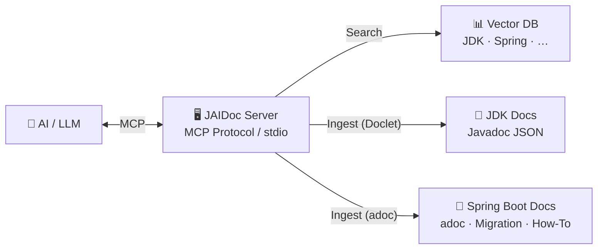

# JAIDoc

[](https://www.oracle.com/java/)
[](https://spring.io/projects/spring-boot)
[](https://maven.apache.org/)
[](LICENSE)

JAIDoc is an **exercise in creating a Model Context Protocol (MCP) server** that makes JDK and Spring Boot documentation
searchable and consumable by AI models. It's a practical example of how to bridge the gap between traditional technical
documentation and AI-driven development workflows — entirely with local AI.

## Why JAIDoc?

The official Java and Spring Boot documentation is vast, well-maintained, and constantly updated — but it's locked
behind HTML pages, versioned separately, and not queryable by AI models in context. When you're coding and need to
verify how a method works or what a class does, you have to leave your IDE, search Google, navigate to the docs site,
and find the right version.

JAIDoc is also an **example for the community** on how to organize, track, and expose technical documentation through
MCP tools. Currently focused on the JDK SDK as a foundation, the project aims to grow into Spring Boot — where
documentation is far more complex (migration guides, how-to guides, AsciiDoc formats, cross-references) — and serve as
a reference for building your own documentation MCP servers.

JAIDoc solves this by letting the local AI model (Qwen 3.6, Gemma-4, or QWOPUS — running on your machine) answer these
questions directly, without relying on cloud APIs or sending code context to third-party services.

It does this by:

1. **Converting** official documentation into structured JSON via a Java Doclet
2. **Indexing** it for semantic search (vector embeddings)
3. **Exposing** it through the MCP protocol so AI models can query it directly

This project demonstrates the full stack: doclet → JSON → vector DB → MCP tools. It's meant to be studied, adapted, and
used as a reference for building your own documentation MCP servers — starting with the JDK SDK and growing into Spring
Boot's more complex documentation ecosystem.

## Local AI Infrastructure

JAIDoc is designed to work entirely with **local AI models** — no cloud APIs required. The project is developed and
tested against the Llama.cpp Server in routing mode, which dynamically selects the best model for each query based on
complexity:

### Hardware

| Component     | Specification                          |
|---------------|----------------------------------------|
| CPU           | Intel Core Ultra 9 275HX               |
| RAM           | 32 GB DDR5-6400                        |
| GPU 1 (local) | NVIDIA RTX 5070 Ti 12GB Mobile         |
| GPU 2 (eGPU)  | NVIDIA RTX 3090 24GB via Thunderbolt 4 |

### Models

#### Model Info

| Model                                         | Quantization | Context Size | URL                                                                               |
|-----------------------------------------------|:------------:|:------------:|-----------------------------------------------------------------------------------|
| LFM2.5-8B-A1B                                 |  UD-IQ4_NL   |  256K (MAX)  | https://huggingface.co/unsloth/LFM2.5-8B-A1B-GGUF                                 |
| Mellum2-12B-A2.5B                             |    Q4_K_M    |  128K (MAX)  | https://huggingface.co/JetBrains/Mellum2-12B-A2.5B-Thinking-GGUF-Q4_K_M           |
| Nex-N2-mini                                   |    IQ4_NL    |  256K (MAX)  | https://huggingface.co/bartowski/nex-agi_Nex-N2-mini-GGUFF                        |
| NVIDIA-Nemotron-3-Nano-Omni-30B-A3B-Reasoning |  IQ4_NL_XL   |  256K (MAX)  | https://huggingface.co/unsloth/NVIDIA-Nemotron-3-Nano-Omni-30B-A3B-Reasoning-GGUF |
| NVIDIA-Nemotron-Cascade-2-30B-A3B             |    IQ4_NL    |   1M (MAX)   | https://huggingface.co/bartowski/nvidia_Nemotron-Cascade-2-30B-A3B-GGUF           |
| Qwen3.6-27B                                   |    IQ4_NL    |  256K (MAX)  | https://huggingface.co/unsloth/Qwen3.6-27B-GGUF                                   |
| Qwen3.6-27B-MTP                               |    IQ4_NL    |  256K (MAX)  | https://huggingface.co/unsloth/Qwen3.6-27B-MTP-GGUF                               |
| Qwen3.6-35B-A3B                               | UD-IQ4_NL_XL |  256K (MAX)  | https://huggingface.co/unsloth/Qwen3.6-35B-A3B-GGUF                               |
| Qwopus3.5-9B                                  |    Q4_K_M    |  256K (MAX)  | https://huggingface.co/Jackrong/Qwopus3.5-9B-v3-GGUF                              |
| Qwopus3.5-9B-Coder                            |    IQ4_XS    |  256K (MAX)  | https://huggingface.co/Jackrong/Qwopus3.5-9B-Coder-GGUF                           |
| Qwopus3.6-27B-Coder                           |    IQ4_XS    |  256K (MAX)  | https://huggingface.co/Jackrong/Qwopus3.6-27B-Coder-GGUF                          |
| Qwopus3.6-27B-Coder-MTP                       |    IQ4_XS    |  256K (MAX)  | https://huggingface.co/Jackrong/Qwopus3.6-27B-Coder-MTP-GGUF                      |
| Qwopus3.6-27B-v2                              |    IQ4_XS    |  256K (MAX)  | https://huggingface.co/Jackrong/Qwopus3.6-27B-v2-GGUF                             |
| Qwopus3.6-27B-v2-MTP                          |    IQ4_XS    |  256K (MAX)  | https://huggingface.co/Jackrong/Qwopus3.6-27B-v2-MTP-GGUF                         |
| Qwopus3.6-35B-A3B-v1                          |    IQ4_XS    |  256K (MAX)  | https://huggingface.co/Jackrong/Qwopus3.6-35B-A3B-v1-GGUF                         |
| Qwopus3.6-35B-A3B-v1-agents                   |    IQ4_XS    |  256K (MAX)  | https://huggingface.co/Jackrong/Qwopus3.6-35B-A3B-v1-GGUF                         |
| gemma-4-12B-it                                |    IQ4_NL    |  128K (MAX)  | https://huggingface.co/unsloth/gemma-4-12b-it-GGUF                                |
| gemma-4-26B-A4B-it                            |  UD-IQ4_NL   |  256K (MAX)  | https://huggingface.co/unsloth/gemma-4-26B-A4B-it-GGUF                            |
| gemma-4-31B-it                                |    IQ4_NL    |     128K     | https://huggingface.co/unsloth/gemma-4-31B-it-GGUF                                |

#### Model Performance

| Model                                         | Parallel-Slots | Preferred agent    | Max (T/S) | Task             |
|-----------------------------------------------|:--------------:|:-------------------|----------:|:-----------------|
| LFM2.5-8B-A1B                                 |       1        | Junie              |           | Simple Code      |
| Mellum2-12B-A2.5B                             |       1        | AI Assistant       |           | Single task code |
| Nex-N2-mini                                   |       1        | Junie, Claude Code |       105 | Very Hard Code   |
| NVIDIA-Nemotron-3-Nano-Omni-30B-A3B-Reasoning |       1        | Junie              |       130 | General          |
| NVIDIA-Nemotron-Cascade-2-30B-A3B             |       1        | Junie              |       160 | Single task code |
| Qwen3.6-27B                                   |       1        | Junie              |        50 | Very Hard Code   |
| Qwen3.6-27B-MTP                               |       1        | Junie              |        50 | Very Hard Code   |
| Qwen3.6-35B-A3B                               |       1        | Junie              |       100 | Hard Code        |
| Qwopus3.5-9B                                  |       1        | Claude Code        |           | Code             |
| Qwopus3.5-9B-Coder                            |       1        | Claude Code        |           | Hard Code        |
| Qwopus3.6-27B-Coder                           |       1        | Claude Code        |        40 | Very Hard Code   |
| Qwopus3.6-27B-Coder-MTP                       |       1        | Claude Code        |        40 | Very Hard Code   |
| Qwopus3.6-27B-v2                              |       1        | Claude Code        |        50 | Very Hard Code   |
| Qwopus3.6-27B-v2-MTP                          |       1        | Claude Code        |        50 | Very Hard Code   |
| Qwopus3.6-35B-A3B-v1                          |       1        | Claude Code        |       117 | Hard Code        |
| Qwopus3.6-35B-A3B-v1-agents                   |       2        | Claude Code        |        60 | Hard Code        |
| gemma-4-12B-it                                |       1        | Junie,Claude Code  |           | Code             |
| gemma-4-26B-A4B-it                            |       1        | Junie,Claude Code  |           | Hard Code        |
| gemma-4-31B-it                                |       1        | Junie,Claude Code  |           | Very Hard Code   |

### AI Agents

The project is developed using multiple AI coding agents, each with different strengths:

| Agent                 | IDE / Platform | Purpose                                                                       |
|-----------------------|----------------|-------------------------------------------------------------------------------|
| Claude Code           | Terminal       | Primary agent — deep research, complex refactors, and architectural decisions |
| IntelliJ AI Assistant | IntelliJ IDEA  | Inline code completion, quick suggestions, and minor fixes within the editor  |
| Junie                 | Terminal       | Alternative agent for comparison — experimental use and secondary opinions    |

## Quick Start

### Build

```bash
mvn clean package
```

### Run

```bash
java -jar target/jaidoc-0.1.0.jar
```

## Example Queries

Once connected, the MCP server exposes tools for querying documentation. Here's what you can do:

- **Search by class name** — Find a specific class and its members
- **Search by method signature** — Look up a method's parameters, return type, and description
- **Keyword search** — Search across all documentation for a term
- **Semantic search** — Find documentation relevant to a natural language question

### Example: Find how to create an HTTP client

You can ask the AI model: *"How do I create a WebClient in Spring Boot?"* and the model will query the MCP server for
Spring Boot documentation, returning the precise API reference with parameters and usage examples.

### Example: Find migration changes (future)

When Spring Boot documentation is ingested, you'll be able to ask: *"What changed in the migration from 3.3 to 3.4?"*
and the model will return the relevant migration guide section with version-specific changes.

## How It Works

### The Doclet Pipeline

The JDK doesn't ship its Javadoc as JSON, so we need to generate it from the source. JAIDoc handles this entirely:

1. **Download / Extract** — Fetch the official JDK source for a given version.
2. **Javadoc Serialization** — Run a custom doclet (`JsonDoclet`) on the JDK source to produce structured JSON directly,
   extracting class signatures, method descriptions, parameters, return types, and annotations in a format optimized for
   LLM comprehension.
3. **Vector Indexing** — Embed and index the JSON data into a vector database for semantic search.
4. **MCP Tools Exposure** — Register MCP tools that allow AI models to query by class name, method signature, keyword
   search, or semantic similarity.

This pipeline is modular and version-aware: each JDK version gets its own ingestion run, and the vector DB stores them
separately so users can query documentation for any supported version.

### The Spring Boot Pipeline (planned)

Spring Boot documentation goes beyond API reference — it includes migration guides, how-to guides, and AsciiDoc
(`.adoc`) formats with richer structure than Javadoc. Ingestion will require a different approach: parsing adoc files,
extracting sections, preserving cross-references, and organizing the data so MCP tools can expose structured queries (
e.g., "what changed in Spring Boot 3.4 migration", "how to configure a custom bean").

This pipeline will also serve as an example for the community on how to organize, track, and expose complex
documentation formats through MCP — a foundation that can be extrapolated to other ecosystems beyond Spring Boot.

## Roadmap

- **Phase 1** — JDK documentation ingestion and MCP tools for querying (current)
- **Phase 2** — Spring Boot ingestion: adoc parsing, migration guides, how-to guides, and structured MCP tools
- **Phase 3** — Spring Framework API docs: annotations, generics, cross-references
- **Phase 4** — Support for additional ecosystems (Quarkus, Micronaut, etc.)
- **Phase 5** — Multi-model support with prompt templates per ecosystem

### Phase 2: Spring Boot Integration

Spring Boot documentation is structured around AsciiDoc (`.adoc`) files — migration guides, how-to guides, and
reference documentation. Unlike JDK Javadoc (which a custom doclet can serialize to JSON), adoc requires a different
ingestion pipeline:

1. **adoc Parsing** — Extract sections, subsections, cross-references, and code examples from Spring Boot's adoc source
2. **Section Organization** — Structure the parsed content hierarchically so MCP tools can query by section, not just by
   keyword
3. **Migration Guide Tracking** — Preserve version-to-version migration paths so queries like "what changed in 3.4"
   return the relevant migration section
4. **How-To Expose** — Register MCP tools that let AI models query "how to do X" by matching natural language to adoc
   section titles and content
5. **Community Example** — Document the ingestion approach so others can replicate it for their own documentation
   ecosystems

Currently this work starts with the Java SDK as a foundation, then extrapolates to Spring Boot — which is where the real
complexity lives (huge MCP schema, complex cross-references, versioned migration guides).

## Architecture



## Tech Stack

| Component | Technology                                                          |
|-----------|---------------------------------------------------------------------|
| Runtime   | Java 25, Spring Boot 4.1.0                                          |
| Build     | Maven 3.9.15                                                        |
| MCP       | Spring AI MCP Server (streamable protocol, stdio)                   |
| JSON      | Jackson 3 (`tools.jackson.*`)                                       |
| Local LLM | Llama.cpp Server (routing mode) (b9637 but use last version always) |

## Philosophy

> *"The best documentation is the kind that an AI can consume in a structured, semantic way — without sacrificing
readability for humans. And the best AI is the kind you run locally, on your own hardware."*

JAIDoc doesn't aim to replace human documentation. It complements it by providing AI assistants with a reliable,
indexed, and searchable source so they can generate more accurate technical answers. The key insight: **documentation
should be machine-readable AND human-readable**. The Doclet output is structured JSON (machine-first), but it faithfully
preserves all the original Javadoc content — the human-readable body, examples, and cross-references are all there for
the LLM to ground its responses on.

Equally important: **this stack runs locally**. No cloud APIs, no API keys, no data leaving your machine. The Llama.cpp
Server + local models provide the same capabilities as any cloud-based AI — and you control the models, the data, and
the privacy.

## Getting Help

- **Doclet internals** — [`documentation/DOCLET.md`](documentation/DOCLET.md)
- **MCP setup** — [`documentation/MCP.md`](documentation/MCP.md)
- **Project structure** — [`documentation/STRUCTURE.md`](documentation/STRUCTURE.md)
- **Jackson configuration** — [`documentation/JACKSON.md`](documentation/JACKSON.md)
- **Development log** — [`BLACKBOOK.md`](BLACKBOOK.md)

## Contributing

Contributions are welcome. Whether you want to extend the Doclet to handle new JDK features, add Spring Boot adoc
parsing, add support for additional ecosystems, or improve the MCP tools — please open an issue or submit a PR.

## License

[Apache License 2.0](LICENSE)
