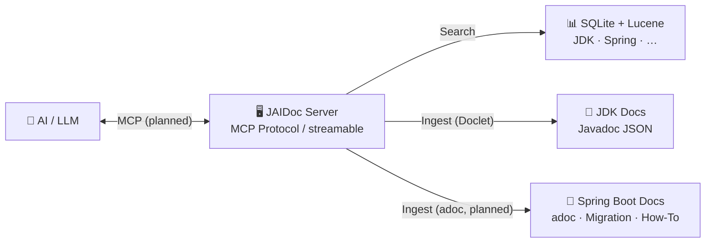

# JAIDoc

[](https://www.oracle.com/java/)
[](https://spring.io/projects/spring-boot)
[](https://maven.apache.org/)
[](LICENSE)

JAIDoc is an **exercise in creating a Model Context Protocol (MCP) server** that makes JDK and Spring Boot documentation
searchable and consumable by AI models. It's a practical example of how to bridge the gap between traditional technical
documentation and AI-driven development workflows — entirely with local AI.

## Why JAIDoc?

The official Java and Spring Boot documentation is vast, well-maintained, and constantly updated — but it's locked
behind HTML pages, versioned separately, and not queryable by AI models in context. When you're coding and need to
verify how a method works or what a class does, you have to leave your IDE, search Google, navigate to the docs site,
and find the right version.

JAIDoc is also an **example for the community** on how to organize, track, and expose technical documentation through
MCP tools. Currently focused on the JDK SDK as a foundation (database layer complete, MCP tools planned), the project
aims to grow into Spring Boot — where documentation is far more complex (migration guides, how-to guides, AsciiDoc
formats, cross-references) — and serve as a reference for building your own documentation MCP servers.

JAIDoc solves this by letting the local AI model (Qwen 3.6, Gemma-4, or QWOPUS — running on your machine) answer these
questions directly, without relying on cloud APIs or sending code context to third-party services.

It does this by:

1. **Converting** official documentation into structured JSON via a Java Doclet
2. **Indexing** it for semantic search (vector embeddings, Hibernate Search/Lucene)
3. **Exposing** it through the MCP protocol so AI models can query it directly

- **Doclet pipeline**: JDK source → `JsonDoclet` → JSON Javadoc (fully implemented)
- **MCP tools** (planned): `listVersions()`, `searchJavadoc()` — JavaDocMCP is a placeholder, no tools implemented yet

This project demonstrates the full stack: doclet → JSON → SQLite + Hibernate Search → MCP tools (planned). It's meant to
be studied, adapted, and used as a reference for building your own documentation MCP servers — starting with the JDK SDK
and growing into Spring Boot's more complex documentation ecosystem.

## Quick Start

### Build

```bash
mvn clean package
```

### Run

```bash
java -jar target/jaidoc-1.0.0.jar
```

### Embedding Model

The app uses a local ONNX transformer model for semantic search (vector embeddings). The model is not tracked in Git —
download it first:

The script will ask which model and variant to download. See [onnx/TRANSFORMER.md](onnx/TRANSFORMER.md) for available
models, variants, and configuration options.

## Example Queries

Planned MCP server tools will expose the following query capabilities:

- **Search by class name** — Find a specific class and its members
- **Search by method signature** — Look up a method's parameters, return type, and description
- **Keyword search** — Search across all documentation for a term
- **Semantic search** — Find documentation relevant to a natural language question (vector embeddings)

### Example: Find how to create an HTTP client

You can ask the AI model: *"How do I create a WebClient in Spring Boot?"* and the model will query the MCP server for
Spring Boot documentation, returning the precise API reference with parameters and usage examples.

### Example: Search for JDK API documentation

You can ask the AI model: *"How do I read a file with NIO?"* and the model will query the MCP server for JDK
documentation, returning the precise API reference with parameters and usage examples.

### Ingesting documentation

Before searching, documentation must be ingested into the database:

- **Doclet pipeline**: Run `JsonDoclet` on the JDK source to produce JSON Javadoc, then store chunks and elements in the
  database via the service layer. The `JdkVersionRepository` tracks which versions have been processed.

The ingest is idempotent — re-ingesting a version replaces any prior ingestion.

## How It Works

### The Doclet Pipeline

The JDK doesn't ship its Javadoc as JSON, so we need to generate it from the source. JAIDoc handles this entirely:

1. **Download / Extract** — Fetch the official JDK source for a given version.
2. **Javadoc Serialization** — Run a custom doclet (`JsonDoclet`) on the JDK source to produce structured JSON directly,
   extracting class signatures, method descriptions, parameters, return types, and annotations in a format optimized for
   LLM comprehension.
3. **Vector Indexing** — Embed and index the JSON data into SQLite + Hibernate Search/Lucene for semantic search.
4. **MCP Tools Exposure** (planned) — Register MCP tools that allow AI models to query by class name, method signature,
   keyword
   search, or semantic similarity.

This pipeline is modular and version-aware: each JDK version gets its own ingestion run, and the database stores them
separately so users can query documentation for any supported version.

## Roadmap

- **Phase 1** — JDK documentation ingestion and database layer; MCP tools for querying (planned)
- **Phase 2** — Spring Boot ingestion: adoc parsing, migration guides, how-to guides, and structured MCP tools
- **Phase 3** — Spring Framework API docs: annotations, generics, cross-references
- **Phase 4** — Support for additional ecosystems (Quarkus, Micronaut, etc.)
- **Phase 5** — Multi-model support with prompt templates per ecosystem

### Phase 2: Spring Boot Integration

Spring Boot documentation is structured around AsciiDoc (`.adoc`) files — migration guides, how-to guides, and
reference documentation. Unlike JDK Javadoc (which a custom doclet can serialize to JSON), adoc requires a different
ingestion pipeline:

1. **adoc Parsing** — Extract sections, subsections, cross-references, and code examples from Spring Boot's adoc source
2. **Section Organization** — Structure the parsed content hierarchically so MCP tools can query by section, not just by
   keyword
3. **Migration Guide Tracking** — Preserve version-to-version migration paths so queries like "what changed in 3.4"
   return the relevant migration section
4. **How-To Expose** — Register MCP tools that let AI models query "how to do X" by matching natural language to adoc
   section titles and content
5. **Community Example** — Document the ingestion approach so others can replicate it for their own documentation
   ecosystems

Currently this work starts with the Java SDK as a foundation, then extrapolates to Spring Boot — which is where the real
complexity lives (huge MCP schema, complex cross-references, versioned migration guides).

## Project Structure

The repository is organized into distinct workspaces, each with a specific purpose:

| Directory        | Purpose                                                                                                                  |
|------------------|--------------------------------------------------------------------------------------------------------------------------|
| `src/`           | Java source code — `main/` for the application, `test/` for unit and integration tests                                   |
| `data/`          | JDK source and JSON documentation — versioned (one directory per JDK version), generated by the doclet pipeline          |
| `documentation/` | Deep-dive technical docs — architecture, database, MCP, security, testing, etc.                                          |
| `features/`      | Feature workspaces — planning context for ongoing feature development (see [features/FEATURES.md](features/FEATURES.md)) |
| `blackbook/`     | Dev log — dated notes and decisions from the developer                                                                   |
| `onnx/`          | Local AI models — ONNX embedding model and tokenizer used for semantic search                                            |
| `doclet/`        | Build output — the doclet JAR produced by Maven                                                                          |
| `assembly/`      | Maven assembly descriptor — packaging configuration for the doclet JAR                                                   |
| `test/`          | IntelliJ HTTP client — `mcp-tools.http` and environment config for manual MCP tool testing                               |

## Architecture



## Philosophy

> *"The best documentation is the kind that an AI can consume in a structured, semantic way — without sacrificing
readability for humans. And the best AI is the kind you run locally, on your own hardware."*

JAIDoc doesn't aim to replace human documentation. It complements it by providing AI assistants with a reliable,
indexed, and searchable source so they can generate more accurate technical answers. The key insight: **documentation
should be machine-readable AND human-readable**. The Doclet output is structured JSON (machine-first), but it faithfully
preserves all the original Javadoc content — the human-readable body, examples, and cross-references are all there for
the LLM to ground its responses on.

Equally important: **this stack runs locally**. No cloud APIs, no API keys, no data leaving your machine. The Llama.cpp
Server + local models provide the same capabilities as any cloud-based AI — and you control the models, the data, and
the privacy.

## Getting Help

- **Doclet internals** — [`documentation/DOCLET.md`](documentation/DOCLET.md)
- **JDK documentation data** — [`documentation/JDK-DATA.md`](documentation/JDK-DATA.md)
- **Database** — [`documentation/DATABASE.md`](documentation/DATABASE.md)
- **AI models** — [`documentation/AI-MODELS.md`](documentation/AI-MODELS.md)
- **MCP setup** — [`documentation/MCP.md`](documentation/MCP.md)
- **Project structure** — [`documentation/STRUCTURE.md`](documentation/STRUCTURE.md)
- **Jackson configuration** — [`documentation/JACKSON.md`](documentation/JACKSON.md)
- **ONNX embedding model** — [`onnx/TRANSFORMER.md`](onnx/TRANSFORMER.md)
- **Development log** — [`blackbook/BLACKBOOK.md`](blackbook/BLACKBOOK.md)

## Contributing

Contributions are welcome. Whether you want to extend the Doclet to handle new JDK features, add Spring Boot adoc
parsing, add support for additional ecosystems, or improve the MCP tools — please open an issue or submit a PR.

## License

[Apache License 2.0](LICENSE)
