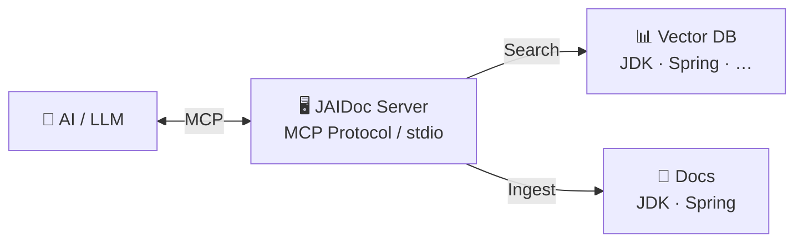

# JAIDoc

[](https://www.oracle.com/java/)
[](https://spring.io/projects/spring-boot)
[](https://maven.apache.org/)
[](LICENSE)

JAIDoc is an **exercise in creating a Model Context Protocol (MCP) server** that makes JDK and Spring Boot documentation
searchable and consumable by AI models. It's a practical example of how to bridge the gap between traditional technical
documentation and AI-driven development workflows — entirely with local AI.

## Why JAIDoc?

The official Java and Spring Boot documentation is vast, well-maintained, and constantly updated — but it's locked
behind HTML pages, versioned separately, and not queryable by AI models in context. When you're coding and need to
verify how a method works or what a class does, you have to leave your IDE, search Google, navigate to the docs site,
and find the right version.

JAIDoc solves this by letting the local AI model (Qwen 3.6, Gemma-4, or QWOPUS — running on your machine) answer these
questions directly, without relying on cloud APIs or sending code context to third-party services.

It does this by:

1. **Converting** official documentation into structured JSON via a Java Doclet
2. **Indexing** it for semantic search (vector embeddings)
3. **Exposing** it through the MCP protocol so AI models can query it directly

This project demonstrates the full stack: doclet → JSON → vector DB → MCP tools. It's meant to be studied, adapted, and
used as a reference for building your own documentation MCP servers.

## Local AI Infrastructure

JAIDoc is designed to work entirely with **local AI models** — no cloud APIs required. The project is developed and
tested against the Llama.cpp Server in routing mode, which dynamically selects the best model for each query based on
complexity:

### Hardware

| Component     | Specification                          |
|---------------|----------------------------------------|
| CPU           | Intel Core Ultra 9 275HX               |
| RAM           | 32 GB DDR5-6400                        |
| GPU 1 (local) | NVIDIA RTX 5070 Ti 12GB Mobile         |
| GPU 2 (eGPU)  | NVIDIA RTX 3090 24GB via Thunderbolt 4 |

### Models

| Model                                         | Quantization | Context Size | Parallel-Slots |  Preferred agent   | Max (T/S) | Task             | URL                                                                               |
|-----------------------------------------------|:------------:|:------------:|:--------------:|:------------------:|----------:|:-----------------|-----------------------------------------------------------------------------------|
| LFM2.5-8B-A1B                                 |  UD-IQ4_NL   |  256K (MAX)  |       1        |       Junie        |           | Simple Code      | https://huggingface.co/unsloth/LFM2.5-8B-A1B-GGUF                                 |
| Mellum2-12B-A2.5B                             |    Q4_K_M    |  128K (MAX)  |       1        |    AI Assistant    |           | Single task code | https://huggingface.co/JetBrains/Mellum2-12B-A2.5B-Thinking-GGUF-Q4_K_M           |
| Nex-N2-mini                                   |    IQ4_NL    |  256K (MAX)  |       1        | Junie, Claude COde |       105 | Very Hard Code   | https://huggingface.co/bartowski/nex-agi_Nex-N2-mini-GGUFF                        |
| NVIDIA-Nemotron-3-Nano-Omni-30B-A3B-Reasoning |  IQ4_NL_XL   |  256K (MAX)  |       1        |       Junie        |       130 | General          | https://huggingface.co/unsloth/NVIDIA-Nemotron-3-Nano-Omni-30B-A3B-Reasoning-GGUF |
| NVIDIA-Nemotron-Cascade-2-30B-A3B             |    IQ4_NL    |   1M (MAX)   |       1        |       Junie        |       160 | Single task code | https://huggingface.co/bartowski/nvidia_Nemotron-Cascade-2-30B-A3B-GGUF           |
| Qwen3.6-27B                                   |    IQ4_NL    |  256K (MAX)  |       1        |       Junie        |        50 | Very Hard Code   | https://huggingface.co/unsloth/Qwen3.6-27B-GGUF                                   |
| Qwen3.6-27B-MTP                               |    IQ4_NL    |  256K (MAX)  |       1        |       Junie        |        50 | Very Hard Code   | https://huggingface.co/unsloth/Qwen3.6-27B-MTP-GGUF                               |
| Qwen3.6-35B-A3B                               | UD-IQ4_NL_XL |  256K (MAX)  |       1        |       Junie        |       100 | Hard Code        | https://huggingface.co/unsloth/Qwen3.6-35B-A3B-GGUF                               |
| Qwopus3.5-9B                                  |    Q4_K_M    |  256K (MAX)  |       1        |    Claude Code     |           | Code             | https://huggingface.co/Jackrong/Qwopus3.5-9B-v3-GGUF                              |
| Qwopus3.5-9B-Coder                            |    IQ4_XS    |  256K (MAX)  |       1        |    Claude Code     |           | Hard Code        | https://huggingface.co/Jackrong/Qwopus3.5-9B-Coder-GGUF                           |
| Qwopus3.6-27B-Coder                           |    IQ4_XS    |  256K (MAX)  |       1        |    Claude Code     |        40 | Very Hard Code   | https://huggingface.co/Jackrong/Qwopus3.6-27B-Coder-GGUF                          |
| Qwopus3.6-27B-Coder-MTP                       |    IQ4_XS    |  256K (MAX)  |       1        |    Claude Code     |        40 | Very Hard Code   | https://huggingface.co/Jackrong/Qwopus3.6-27B-Coder-MTP-GGUF                      |
| Qwopus3.6-27B-v2                              |    IQ4_XS    |  256K (MAX)  |       1        |    Claude Code     |        50 | Very Hard Code   | https://huggingface.co/Jackrong/Qwopus3.6-27B-v2-GGUF                             |
| Qwopus3.6-27B-v2-MTP                          |    IQ4_XS    |  256K (MAX)  |       1        |    Claude Code     |        50 | Very Hard Code   | https://huggingface.co/Jackrong/Qwopus3.6-27B-v2-MTP-GGUF                         |
| Qwopus3.6-35B-A3B-v1                          |    IQ4_XS    |  256K (MAX)  |       1        |    Claude Code     |       117 | Hard Code        | https://huggingface.co/Jackrong/Qwopus3.6-35B-A3B-v1-GGUF                         |
| Qwopus3.6-35B-A3B-v1-agents                   |    IQ4_XS    |  256K (MAX)  |       2        |    Claude Code     |        60 | Hard Code        | https://huggingface.co/Jackrong/Qwopus3.6-35B-A3B-v1-GGUF                         |
| gemma-4-12B-it                                |    IQ4_NL    |  128K (MAX)  |       1        | Junie,Claude Code  |           | Code             | https://huggingface.co/unsloth/gemma-4-12b-it-GGUF                                |
| gemma-4-26B-A4B-it                            |  UD-IQ4_NL   |  256K (MAX)  |       1        | Junie,Claude Code  |           | Hard Code        | https://huggingface.co/unsloth/gemma-4-26B-A4B-it-GGUF                            |
| gemma-4-31B-it                                |    IQ4_NL    |     128K     |       1        | Junie,Claude Code  |           | Very Hard Code   | https://huggingface.co/unsloth/gemma-4-31B-it-GGUF                                |

### Setup

1. Start the Llama.cpp Server with your preferred model(s):
   ```bash
   llama.cpp-server --model <path-to-model> --host 127.0.0.1 --port 8080
   ```

2. Configure the MCP server to connect to the local LLM endpoint in `application.yaml`:
   ```yaml
   spring:
     ai:
       openai:
         api-key: dummy
         base-url: http://127.0.0.1:8080/v1
   ```

3. Start the JAIDoc server — the MCP tools will be available for the local model to call.

### AI Agents

The project is developed using multiple AI coding agents, each with different strengths:

| Agent                 | IDE / Platform | Purpose                                                                       |
|-----------------------|----------------|-------------------------------------------------------------------------------|
| Claude Code           | Terminal       | Primary agent — deep research, complex refactors, and architectural decisions |
| IntelliJ AI Assistant | IntelliJ IDEA  | Inline code completion, quick suggestions, and minor fixes within the editor  |
| Junie                 | Terminal       | Alternative agent for comparison — experimental use and secondary opinions    |

## Quick Start

### Build

```bash
mvn clean package
```

### Run

```bash
java -jar target/jaidoc-0.1.0.jar
```

## Example Queries

Once connected, the MCP server exposes tools for querying documentation. Here's what you can do:

- **Search by class name** — Find a specific class and its members
- **Search by method signature** — Look up a method's parameters, return type, and description
- **Keyword search** — Search across all documentation for a term
- **Semantic search** — Find documentation relevant to a natural language question

### Example: Find how to create an HTTP client

You can ask the AI model: *"How do I create a WebClient in Spring Boot?"* and the model will query the MCP server for
Spring Boot documentation, returning the precise API reference with parameters and usage examples.

## How It Works

### The Doclet Pipeline

The JDK doesn't ship its Javadoc as JSON, so we need to generate it ourselves. JAIDoc handles this entirely:

1. **Download / Extract** — Fetch the official JDK source or binary distribution for a given version.
2. **Javadoc Generation** — Run `javadoc` on the JDK source to produce HTML Javadoc (or parse existing HTML if sources
   aren't available).
3. **HTML → JSON Conversion** — Transform the generated HTML into structured JSON, extracting class signatures, method
   descriptions, parameters, return types, and annotations in a format optimized for LLM comprehension.
4. **Vector Indexing** — Embed and index the JSON data into a vector database for semantic search.
5. **MCP Tools Exposure** — Register MCP tools that allow AI models to query by class name, method signature, keyword
   search, or semantic similarity.

This pipeline is modular and version-aware: each JDK version gets its own ingestion run, and the vector DB stores them
separately so users can query documentation for any supported version. The same approach will be reused for Spring
Framework, where we'll parse Spring's API docs (which are more complex due to annotations, generics, and
cross-references).

## Roadmap

- **Phase 1** — JDK documentation ingestion and MCP tools for querying (current)
- **Phase 2** — Spring Framework documentation ingestion (annotations, generics, cross-references)
- **Phase 3** — Support for additional ecosystems (Quarkus, Micronaut, etc.)
- **Phase 4** — Multi-model support with prompt templates per ecosystem

## Architecture



## Tech Stack

| Component   | Technology                                                                                                 |
|-------------|------------------------------------------------------------------------------------------------------------|
| Runtime     | Java 25, Spring Boot 4.0.6                                                                                 |
| Build       | Maven 3.9.15                                                                                               |
| MCP         | Spring AI MCP Server (streamable protocol, stdio)                                                          |
| JSON        | Jackson 3 (`tools.jackson.*`)                                                                              |
| Doclet      | JDK `jdk.javadoc.doclet` API                                                                               |
| IDE Adapter | `@pyroprompts/mcp-stdio-to-streamable-http-adapter`                                                        |
| Local LLM   | Llama.cpp Server (routing mode)                                                                            |
| Models      | Qwen 3.6 (27B dense / 35B MOE), Gemma-4 (31B dense / 26B MOE), QWOPUS (27B dense / 35B MOE) — all with MTP |

## Philosophy

> *"The best documentation is the kind that an AI can consume in a structured, semantic way — without sacrificing
readability for humans. And the best AI is the kind you run locally, on your own hardware."*

JAIDoc doesn't aim to replace human documentation. It complements it by providing AI assistants with a reliable,
indexed, and searchable source so they can generate more accurate technical answers. The key insight: **documentation
should be machine-readable AND human-readable**. The Doclet output is structured JSON (machine-first), but it faithfully
preserves all the original Javadoc content — the human-readable body, examples, and cross-references are all there for
the LLM to ground its responses on.

Equally important: **this stack runs locally**. No cloud APIs, no API keys, no data leaving your machine. The Llama.cpp
Server + local models provide the same capabilities as any cloud-based AI — and you control the models, the data, and
the privacy.

## Getting Help

- **Doclet internals** — [`documentation/DOCLET.md`](documentation/DOCLET.md)
- **MCP setup** — [`documentation/MCP.md`](documentation/MCP.md)
- **Project structure** — [`documentation/STRUCTURE.md`](documentation/STRUCTURE.md)
- **JDK source ingestion** — [`documentation/JDK-SOURCES.md`](documentation/JDK-SOURCES.md)
- **Jackson configuration** — [`documentation/JACKSON.md`](documentation/JACKSON.md)

## Contributing

Contributions are welcome. Whether you want to extend the Doclet to handle new JDK features, add support for additional
ecosystems, or improve the MCP tools — please open an issue or submit a PR.

## License

[Apache License 2.0](LICENSE)
