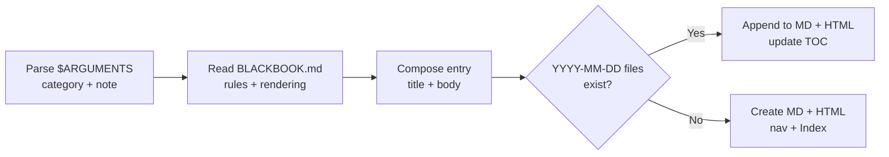

# 2026-06-15

### 🔄 JDK Source Approach Abandoned

Found that using JDK source was not the right approach. Needed to use pre-compiled versions instead to be able to
generate JSON Javadoc and have a working flow. The source-only approach didn't work for the intended goal.

### 🏗️ Current Status

- Pre-compiled JDK versions are now being used
- JSON Javadoc generation is working
- The DB is pre-configured — only the DB connection itself remains
- The MCP server implementation is the remaining work

### 📋 Next Steps

- Leave a basic example in a dedicated folder as a reference/template
- Start populating the DB with information
- Build out the MCP server logic on top of the existing data layer

### 🏗️ Black Book Note Command & Rendering Spec

Added a `/jaidoc:blackbook-note` command that authors a dated Black Book note in both Markdown and HTML, and extended
`BLACKBOOK.md` with the HTML/Mermaid rendering spec the command relies on.

- New command at `.claude/commands/jaidoc/blackbook-note.md` — appends to today's files if they exist, or creates a new
  day and wires up footer navigation and the Index.
- `BLACKBOOK.md` now documents the category → CSS-class mapping, the HTML page skeleton, the Markdown → HTML element
  mapping, and the Mermaid rendering rules.
- Mermaid: a `mermaid` fenced block becomes `<pre class="mermaid">` with an escaped source, and the head `<style>` and body
  `<script>` blocks are injected the first time a page gains a diagram.

#### 🔗 Command Flow

