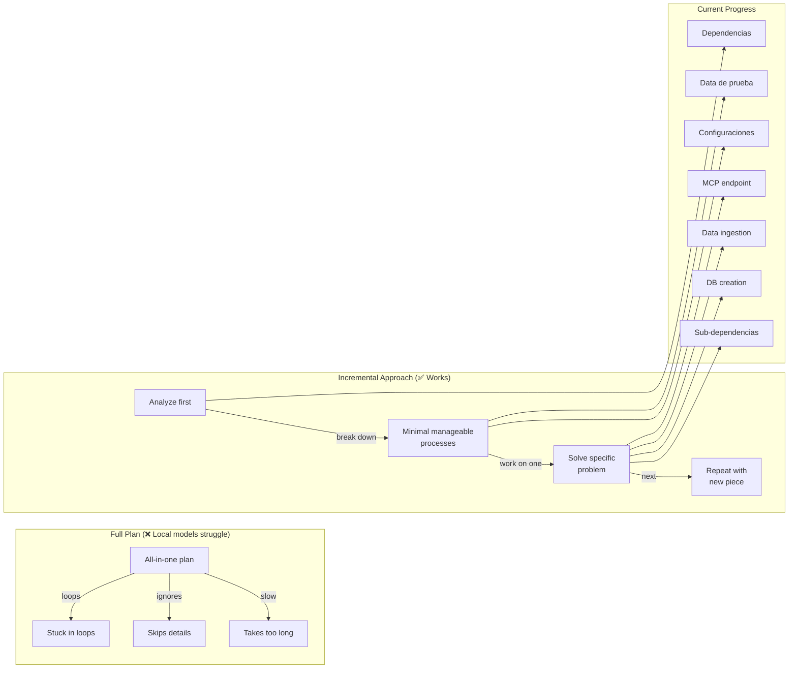

# 2026-06-17

### 💡 Plan Rules Removed — Incremental Workover

Removed the plan rules from CLAUDE.md — they were a constraint and got in the way of actual work. Kept only the features
section for now, since I'm working through processes step by step.

**Key insight:** Problems cannot be tackled head-on. There must always be prior analysis and gradual problem-solving —
working on one piece at a time.

**Open question:** Can the local model divide and separate tasks into manageable sub-tasks? When creating full plans,
local models lack the power — they end up in loops, ignore many things, or take too long to respond. Instead of full
plans, the approach should be to design a flow with local AI that breaks features or tasks into minimal manageable
processes that can be worked on without much effort.

### 💡 Task Progress Log

Work has progressed incrementally through layers:

- **Dependencias** — resolved dependency issues first
- **Configuraciones** — fixed configuration problems
- **Sub-dependencias** — prepared sub-dependencies
- **Data de prueba** — set up test data
- **Now:** DB creation, data ingestion, MCP endpoint

A long road, but getting closer. Would like graphs and visual elements to help with understanding the full picture.

### 🔗 Task Decomposition Flow

### 📝 AI Tool Observations — Consistency, Prompting, and MCP Usage

The DB session was quite difficult. Had to make multiple attempts to reach a functional point — even tried creating a plan with a large model like Opus 4.8 and everything turned out messy. Had to minimize the prompt and fill many gaps, indicating where to take data, where the classes were, how to order for the DB, the balance point between SQL search and Hibernate Search search, and even had to provide Hibernate Search details. A big headache.

**Current state:** Something semi-functional. Know I'm short on direct SQL query functionality, but will address that later — want to get it into a functional stage first.

**Observations on model consistency:**
- Cloud and local models alike sometimes need a reset — the same model that has worked well for hours simply breaks, and even simple commands stop working
- Guessing it's by design, but it's uncomfortable not having at least a minimally consistent level of performance
- Will try other MCP models from the same qwen family for faster results, so failures are less tedious and annoying

**Observations on tool behavior:**
- Claude Code doesn't follow the elements in its own CLAUDE.md very well, especially when it comes to file reading via MCP — it seems to disregard them
- Junie CLI is much more correct with MCP usage and prioritizes it heavily
- The advantages of Claude Code are sequential criteria and certain practical commands, but Junie is more practical and agile
- Need to examine how the qwopus models work in Junie with more detail and update my information
