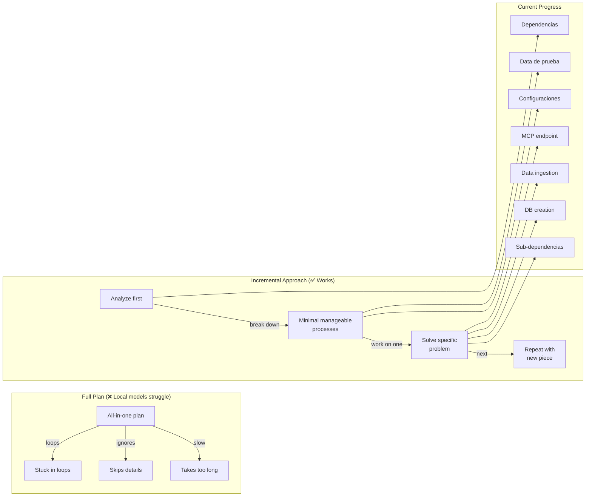

# 2026-06-17

### 💡 Plan Rules Removed — Incremental Workover

Removed the plan rules from CLAUDE.md — they were a constraint and got in the way of actual work. Kept only the features section for now, since I'm working through processes step by step.

**Key insight:** Problems cannot be tackled head-on. There must always be prior analysis and gradual problem-solving — working on one piece at a time.

**Open question:** Can the local model divide and separate tasks into manageable sub-tasks? When creating full plans, local models lack the power — they end up in loops, ignore many things, or take too long to respond. Instead of full plans, the approach should be to design a flow with local AI that breaks features or tasks into minimal manageable processes that can be worked on without much effort.

### 💡 Task Progress Log

Work has progressed incrementally through layers:

- **Dependencias** — resolved dependency issues first
- **Configuraciones** — fixed configuration problems
- **Sub-dependencias** — prepared sub-dependencies
- **Data de prueba** — set up test data
- **Now:** DB creation, data ingestion, MCP endpoint

A long road, but getting closer. Would like graphs and visual elements to help with understanding the full picture.

#### 🔗 Task Decomposition Flow

