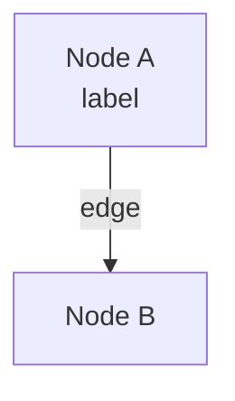

# Black Book

> A log of thoughts, problems, and details encountered during AI-assisted development of this project.

## Purpose

This file captures the informal side of building JAIDoc with AI — things that don't belong in Javadoc, commit messages,
or documentation:

- **Thoughts** — Design decisions, trade-offs, and "why I chose this" moments that deserve a record
- **Problems** — Bugs, blockers, and gotchas that took time to resolve, so we don't forget how we fixed them
- **Details** — Small quirks, workarounds, and observations about the AI tools and workflow

Each dated entry lives in its own pair of files — `YYYY-MM-DD.md` and `YYYY-MM-DD.html`. This file is the Black Book's
**rules and index**: the [Index](#index) below lists every entry, most recent first, so the current state of the
project is always immediately visible. New notes made on the same day are appended to that day's existing files (both
formats), so entries from the same session stay grouped together.

It's not a formal artifact. It's a scratchpad for the things worth remembering, but that doesn't fit anywhere else.

## Rules

### Entry Format

- Each note is a separate HTML file named with the date: `YYYY-MM-DD.html`
- Markdown notes (`.md`) are also allowed for quick text-based entries
- Place notes in the `blackbook/` directory alongside this file
- HTML entries link the shared `blackbook.css` stylesheet so every note keeps the same look
- The most recent entry goes directly after the Purpose section of this file

### Entry Content

- Use emoji prefixes to categorize entries:
    - `🔄` — Change, pivot, approach abandoned
    - `🏗️` — Architecture, structure, system design
    - `📋` — Planning, next steps, todo
    - `🐛` — Bugs, blockers, gotchas
    - `💡` — Ideas, insights, discoveries
    - `📝` — Documentation, notes, observations
- Keep entries concise and scannable
- Use bullet points for status updates
- Include links to related files or decisions when relevant

### File Naming

- Markdown: `YYYY-MM-DD.md`
- HTML: `YYYY-MM-DD.html`
- Both formats are welcome — use Markdown for quick text notes, HTML for richer formatting

### Same-Day Appending

- A note belongs to **today's date** (`YYYY-MM-DD`).
- **If `YYYY-MM-DD.md` and `YYYY-MM-DD.html` already exist**, the new note is **appended** to them — never create a
  second file for the same day. Add the new entry *after* the existing entries (chronological within the day) in both
  files.
- **If they do not exist**, create both files from the templates in [HTML Rendering](#html-rendering) and the Markdown
  shape below, wire up navigation (see [Cross-Entry Navigation](#cross-entry-navigation)), and prepend the day to the
  [Index](#index).
- The `.md` and `.html` files must always stay in sync: every entry exists in both, with the same title, category,
  and content.

Markdown file shape:

```markdown
# YYYY-MM-DD

### EMOJI Entry Title

Body paragraphs, lists, code, tables, or mermaid blocks.

### EMOJI Next Entry Title

...
```

- The date is the only `#` (h1). Each entry is an `###` (h3) heading that starts with its category emoji.
- Subsections inside a long entry use `####` (h4).

### Cross-Entry Navigation

Each HTML entry ends with a footer that links to the previous day, the index, and the next day:

- Oldest entry: `[ Index | next → ]`
- Newest entry: `[ ← prev | Index ]`
- Any entry in the middle: `[ ← prev | Index | next → ]`

When a **new-dated file** becomes the newest entry:

1. Give it a footer of `[ ← <previous-date> | Index ]`.
2. Edit the previously newest file's footer to add the `<new-date> →` next link.
3. Prepend the new day to the [Index](#index).

## HTML Rendering

Every HTML entry links the shared `blackbook.css`, so the markup must use the classes that stylesheet defines. Use
this section as the source of truth when generating HTML from a note.

### Category Mapping

Each category emoji maps to a CSS modifier class (used on both the `<section>` and the table-of-contents `<li>`) and a
tab label:

| Emoji | Meaning       | CSS class    | Tab label          |
|-------|---------------|--------------|--------------------|
| 🔄    | Change        | `cat-change` | `🔄 Change`        |
| 🏗️   | Architecture  | `cat-arch`   | `🏗️ Architecture` |
| 📋    | Planning      | `cat-plan`   | `📋 Planning`      |
| 🐛    | Bug           | `cat-bug`    | `🐛 Bug`           |
| 💡    | Idea          | `cat-idea`   | `💡 Idea`          |
| 📝    | Documentation | `cat-docs`   | `📝 Documentation` |

### Page Structure

A dated HTML file is a single `<article class="bb-page">` with a header, a table-of-contents nav, one `<section>` per
entry, and a footer. Skeleton (placeholders in `<<...>>`):

```html
<!DOCTYPE html>
<html lang="en">
<head>
    <meta charset="UTF-8">
    <meta name="viewport" content="width=device-width, initial-scale=1.0">
    <title><<YYYY-MM-DD>> — Black Book</title>
    <link rel="stylesheet" href="blackbook.css">
    <!-- MERMAID STYLE BLOCK — include only if the page has a mermaid diagram -->
</head>
<body>
<article class="bb-page">
    <header class="bb-head">
        <p class="bb-eyebrow">Black Book · Dev Log</p>
        <h1 class="bb-date"><
            <YYYY-MM-DD>>
        </h1>
        <p class="bb-meta">JAIDoc — AI-assisted development</p>
    </header>

    <nav class="bb-contents" aria-label="In this entry">
        <p class="toc-title">In this entry</p>
        <ul class="bb-toc">
            <li class="<<cat-X>>"><a href="#<<slug>>"><
                <Entry Title>>
            </a></li>
            <!-- one <li> per entry; nest a <ul class="toc-sub cat-X"> for an entry with subsections -->
        </ul>
    </nav>

    <section class="entry <<cat-X>>" id="<<slug>>">
        <p class="tab"><
            <EMOJI Label>>
        </p>
        <h2><
            <Entry Title>>
        </h2>
        <!-- entry body -->
    </section>
    <!-- one <section> per entry, in chronological order -->

    <footer class="bb-foot">
        <span>Black Book · JAIDoc</span>
        <nav>
            <!-- ← prev | Index | next → per Cross-Entry Navigation -->
            <a href="BLACKBOOK.md">Index</a>
        </nav>
    </footer>
</article>
<!-- MERMAID SCRIPT BLOCK — include only if the page has a mermaid diagram -->
</body>
</html>
```

- `<<slug>>` is the entry (or subsection) title in kebab-case (lowercase, spaces → `-`, drop punctuation/emoji),
  unique within the page.
- The `.tab` text is the category tab label from the table above; the `<h2>` is the plain title (no emoji).
- For an entry with subsections, add a nested `<ul class="toc-sub cat-X">` of `<li><a href="#sub-slug">…</a></li>`
  under that entry's `<li>`, and render each subsection as `<h3 id="sub-slug">EMOJI Subsection</h3>`.

### Markdown → HTML Mapping

| Markdown                        | HTML                                                                       |
|---------------------------------|----------------------------------------------------------------------------|
| Entry heading `### EMOJI Title` | `.tab` label + `<h2>Title</h2>` inside a `<section>`                       |
| Subsection `#### EMOJI Title`   | `<h3 id="slug">EMOJI Title</h3>`                                           |
| Standalone `**Label**` line     | `<h4>Label</h4>`                                                           |
| Paragraph                       | `<p>…</p>`                                                                 |
| Bullet `- item`                 | `<ul><li>…</li></ul>`                                                      |
| Numbered `1. item`              | `<ol><li>…</li></ol>`                                                      |
| Inline code span                | `<code>…</code>`                                                           |
| `**bold**`                      | `<strong>…</strong>`                                                       |
| Blockquote `> note`             | `<blockquote><p>…</p></blockquote>`                                        |
| Fenced code block               | `<pre><code>…</code></pre>` (HTML-escaped)                                 |
| Pipe table                      | `<div class="bb-table"><table>…</table></div>` with `<th>` header cells    |
| Fenced `mermaid` block          | `<pre class="mermaid">…</pre>` (see [Mermaid Diagrams](#mermaid-diagrams)) |

Always HTML-escape text that goes into `<pre>`/`<code>`: replace `&` → `&amp;` **first**, then `<` → `&lt;` and
`>` → `&gt;`.

### Mermaid Diagrams

A mermaid diagram authored in Markdown as a fenced ` ```mermaid ` block must be rendered in HTML as a
`<pre class="mermaid">` element — a plain `<pre><code>` would **not** be picked up by Mermaid. The diagram source is
HTML-escaped exactly like any other `<pre>` content, so Mermaid syntax changes form:

- `-->` becomes `--&gt;`
- `<br/>` becomes `&lt;br/&gt;`
- `&` becomes `&amp;`

Example — this Markdown:



it becomes this HTML:

```html

<pre class="mermaid">graph TB
    A["Node A&lt;br/&gt;label"] --&gt;|edge| B["Node B"]</pre>
```

When a page contains **at least one** mermaid diagram, add the two blocks below (and omit them when there is no
diagram). If you append the **first** diagram to a page that had none, add both blocks then; if the page already has a
diagram, leave them untouched.

**Head style block** (inside `<head>`, after the stylesheet link) — keeps edge labels legible on the dark panel and
makes the SVG responsive:

```html

<style>
    /* keep Mermaid edge labels legible on the dark diagram panel */
    .mermaid[data-processed="true"] .edgeLabel,
    .mermaid[data-processed="true"] .edgeLabel * {
        color: #cfd6df !important;
        fill: #cfd6df;
    }

    .mermaid svg {
        max-width: 100%;
        height: auto;
    }
</style>
```

**Body script block** (just before `</body>`) — loads Mermaid and applies the Black Book dark theme:

```html

<script type="module">
    import mermaid from 'https://cdn.jsdelivr.net/npm/mermaid@10/dist/mermaid.esm.min.mjs';

    mermaid.initialize({
        startOnLoad: true,
        theme: 'base',
        themeVariables: {
            fontFamily: "'JetBrains Mono', ui-monospace, monospace",
            fontSize: '13px',
            background: '#10141b',
            primaryColor: '#1b212b',
            primaryBorderColor: '#3a4452',
            primaryTextColor: '#dfe4ea',
            lineColor: '#6e7d8f',
            tertiaryColor: '#161b22',
            clusterBkg: '#141922',
            clusterBorder: '#2b3543',
            titleColor: '#dfe4ea',
            edgeLabelBackground: '#10141b'
        }
    });
</script>
```

## Index

Most recent first. Each line links the HTML and Markdown files for a day.

- **2026-06-17** — [HTML](2026-06-17.html) · [Markdown](2026-06-17.md)
- **2026-06-15** — [HTML](2026-06-15.html) · [Markdown](2026-06-15.md)
- **2026-06-14** — [HTML](2026-06-14.html) · [Markdown](2026-06-14.md)
