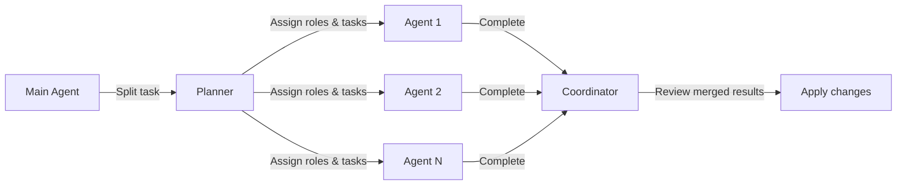

# Parallel AI Agents Workflow

A lightweight, configurable framework for running multiple AI agents in parallel on independent tasks. Inspired
by [superpowers](https://github.com/obra/superpowers), simplified for direct use as a project reference.

## Configuration

Set the number of parallel agents you want to use at the top of your task prompt:

```yaml
parallel_agents_count: 3
```

This value controls how many agents are spawned. Adjust it based on task complexity and independence of subtasks.

**Rules:**

- Minimum: `1` (sequential, no parallelism)
- Recommended: `2-4` for most development tasks
- Maximum: it depends on the scope – only split if subtasks are **truly independent**

## Agent Roles

Each agent is assigned a role. Roles define what the agent should focus on. Use these predefined roles or create your
own:

| Role          | Description                               | Example Tasks                                           |
|---------------|-------------------------------------------|---------------------------------------------------------|
| `CodeAgent`   | Implements or modifies source code        | New features, bug fixes, refactoring                    |
| `TestAgent`   | Writes and updates tests                  | Unit tests, integration tests, edge cases               |
| `DocsAgent`   | Creates or updates documentation          | README, Javadoc, design docs, API docs                  |
| `ConfigAgent` | Manages configuration files               | application.yaml, pom.xml, environment setup            |
| `ReviewAgent` | Reviews changes and validates consistency | Code review, style checks, cross-reference verification |

You can assign roles explicitly:

```yaml
agents:
  - id: agent-1
    role: CodeAgent
    task: "Implement the authentication endpoint in UserController"
  - id: agent-2
    role: TestAgent
    task: "Write unit tests for UserService methods"
  - id: agent-3
    role: DocsAgent
    task: "Update API documentation for /api/auth endpoints"
```

## Task Splitting Rules

Before spawning agents, verify that subtasks meet **all** of these criteria:

1. **Independence** – No subtask depends on another output or modifications to the same file(s).
2. **Clear boundaries** – Each task has well-defined input/output and owns specific files or modules.
3. **Self-contained** - A single agent can complete its task without asking for clarification from another agent.
4. **No shared state** – Agents must not read/write the same file, class, or variable.

If any criterion fails, the tasks should be run sequentially instead of in parallel.

## Execution Flow



1. **Planner** (Main Agent) splits the overall task into independent subtasks.
2. Each subtask is assigned a role and given to an agent.
3. Agents execute **independently** – no communication, no shared reads/writes.
4. All agents signal completion to the Coordinator.
5. Coordinator reviews all outputs and applies them together.

## Communication Rules

- **No inter-agent communication.** Each agent works in isolation.
- If a task requires another agent output, it must be described as a **precondition** in the task definition, not
  generated on the fly.
- All shared context (project structure, conventions, constraints) comes from the prompt instructions, not from other
  agents.

## Merge & Review

After all agents complete:

1. **Check for conflicts** – Ensure no two agents modified the same file without coordination.
2. **Validate consistency** - Cross-reference changes across files for coherence.
3. **Apply atomically** – Present all changes together for review before committing.
4. **Fail fast** – If any agent output is inconsistent or incomplete, re-run only that agent instead of merging partial
   results.

## Example Usage

```yaml
# At the top of your task prompt:
parallel_agents_count: 3

# Task definition:
task: "Add REST endpoint for user management"

# Agent assignments:
agents:
  - id: agent-1
    role: CodeAgent
    task: "Create UserController, UserService, and UserRepository for CRUD operations on User entity"
  - id: agent-2
    role: TestAgent
    task: "Write unit tests for UserService and integration tests for UserController endpoints"
  - id: agent-3
    role: DocsAgent
    task: "Add Javadoc to all public methods in the new user management classes"

# Constraints:
constraints:
  - "Each agent must follow AGENTS.md guidelines"
  - "CodeAgent must use constructor injection"
  - "TestAgent must cover edge cases and error scenarios"
```

## When NOT to Use Parallel Agents

Avoid parallel execution when:

- Tasks share the same files or classes.
- One task depends on the API design of another (e.g., endpoint signatures).
- The task is small – overhead of coordination outweighs benefits.
- Agents need real-time feedback from each other's work.
- Review complexity exceeds the value of parallelism.

## Quick Reference

| Setting                 | Value                                                     | Purpose                                   |
|-------------------------|-----------------------------------------------------------|-------------------------------------------|
| `parallel_agents_count` | 1-N                                                       | Number of agents to spawn                 |
| `agents[].role`         | CodeAgent, TestAgent, DocsAgent, ConfigAgent, ReviewAgent | Agent specialization                      |
| `agents[].task`         | string                                                    | Specific, self-contained task description |
| `constraints[]`         | list                                                      | Shared rules all agents must follow       |
